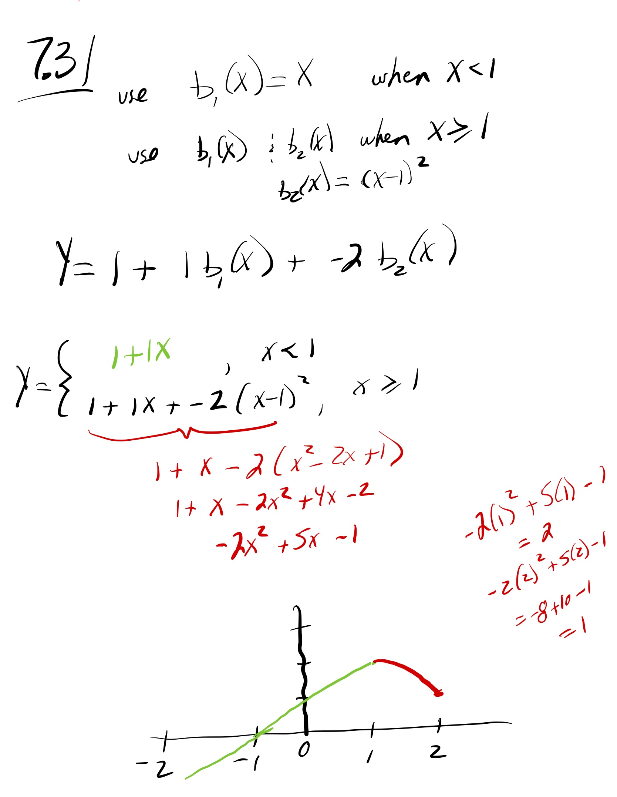

```{r setup, include=FALSE}
knitr::opts_chunk$set(echo = TRUE)
library(MASS)
library(ISLR)
library(boot)
library(splines)
library(leaps)
```
{width=75%}  

## 7.9
```{r echo=FALSE}
#a
df <- Boston
fit.a <- lm(nox~poly(dis,3),data=Boston)
#summary(fit.a)

dislim = range(Boston$dis)
dis.grid = seq(from=dislim[1], to=dislim[2], by=0.1)
fit.a.pred = predict(fit.a, list(dis=dis.grid))
plot(nox~dis, data=Boston, col="darkgrey")
lines(dis.grid, fit.a.pred, col="red", lwd=2)

plot(predict(fit.a), residuals(fit.a))
```

```{r}
#b
degree <- rep(NA,10)
RSS <- rep(NA,10)
for (d in 1:10) {
  fit <- lm(nox~poly(dis,d),data=Boston)
  degree[d] <- d
  RSS[d] <- sum(fit$residuals^2)
}
plot(degree, RSS)
```
```{r}
#c
delta <- rep(NA,10)
for (d in 1:10) {
  fit <- glm(nox~poly(dis,d),data=Boston)
  degree[d] <- d
  delta[d] <- cv.glm(Boston, fit, K=10)$delta[2]
}
plot(degree, delta)
```

```{r echo=FALSE}
cat("The polynomial with lowest cross validation error is polynomial with degree", which.min(delta))
```
When this chunk is run several times, the cross validation error consistantly decreases until about degree 3 or 4, and then increases.  An interesting artifact (of overfitting?) is that in about 1 in 10 runs of this chunk, the degree 10 polynomial has the smallest cross validation error.

```{r}
#d
fit.d <- lm(nox~bs(dis, df=4, knots=c(3, 4.5, 9)), data=Boston)
#summary(fit.d)

dislim = range(Boston$dis)
dis.grid = seq(from=dislim[1], to=dislim[2], by=0.1)
fit.d.pred = predict(fit.d, list(dis=dis.grid))
plot(nox~dis, data=Boston, col="darkgrey")
lines(dis.grid, fit.a.pred, col="red", lwd=1, lty=2)
lines(dis.grid, fit.d.pred, col="green", lwd=2)
 
plot(predict(fit.d), residuals(fit.d))
```
I chose the knots by looking at the dis vs. nox plot and noticing the places where it visually looked like nox was changing quickly (the horizontal gaps in the scatterplot).  I've also plotted (red dotted line) the original poly fit from part a.
```{r warning=FALSE}
#e
dfreedom <- rep(NA,20)
RSS <- rep(NA,20)
for (d in 1:20) {
  fit <- lm(nox~bs(dis, df=d), data=Boston)
  dfreedom[d] <- d
  RSS[d] <- sum(fit$residuals^2)
}
plot(dfreedom, RSS)
```

```{r warning=FALSE}
#f
delta <- rep(NA,20)
for (d in 1:20) {
  fit <- glm(nox~bs(dis, df=d), data=Boston)
  dfreedom[d] <- d
  delta[d] <- cv.glm(Boston, fit, K=10)$delta[2]
}
plot(dfreedom, delta)
```

```{r echo=FALSE}
cat("The degrees of freedom for the regression splines with the lowest cross validation error is this many df:", which.min(delta))
```
Running this chunk many times, I've seen that the lowest cross validation error is more often than not 10 degrees of freedom.  

## 7.10  

```{r}
these <- sample(nrow(College),nrow(College)/2)
train <- College[these,]
test <- College[-these,]

#a
fit.a <- regsubsets(Outstate~.,data=train, nvmax=17, method="forward")
#summary(fit.a)
par(mfrow=c(1,3))
#Cp
plot(summary(fit.a)$cp,xlab="Number of Variables",ylab="Cp")
small.cp <- which.min(summary(fit.a)$cp)
cp.se <- sd(summary(fit.a)$cp)
for (i in 1:17){
  if (summary(fit.a)$cp[i] < (summary(fit.a)$cp[small.cp] + .2*cp.se)){
    break
  }
  smallest.cp <- i
}
points(smallest.cp, summary(fit.a)$cp[smallest.cp], col="red", cex=2, pch=20)
cat("The simplest model within .2 of a standard deviation of the the lowest Cp has this many variables:", smallest.cp)

#BIC
plot(summary(fit.a)$bic,xlab="Number of Variables",ylab="BIC")
small.bic <- which.min(summary(fit.a)$bic)
bic.se <- sd(summary(fit.a)$bic)
for (i in 1:17){
  if (summary(fit.a)$bic[i] < (summary(fit.a)$bic[small.bic] + .2*bic.se)){
    break
  }
  smallest.bic <- i
}
points(smallest.bic, summary(fit.a)$bic[smallest.bic], col="red", cex=2, pch=20)
cat("The simplest model within .2 of a standard deviation of the the lowest BIC has this many variables:", smallest.bic)

#adjR2
plot(summary(fit.a)$adjr2,xlab="Number of Variables",ylab="Adjusted R^2")
big.adjr2 <- which.max(summary(fit.a)$adjr2)
adjr2.se <- sd(summary(fit.a)$adjr2)
for (i in 1:17){
  if (summary(fit.a)$adjr2[i] > (summary(fit.a)$adjr2[big.adjr2] - .2*adjr2.se)){
    break
  }
  smallest.adjr2 <- i
}
points(smallest.adjr2, summary(fit.a)$adjr2[smallest.adjr2], col="red", cex=2, pch=20)
cat("The simplest model within .2 of a standard deviation of the the lowest AdjustedR^2 has this many variables:", smallest.adjr2)
```
Looking at the Cp, the BIC, and the Adjusted R^2 and looking for the simpliest model close to the lowest (highest for Adjusted R^2) I've decided to use 5 variables in my model.
```{r}
#b
```